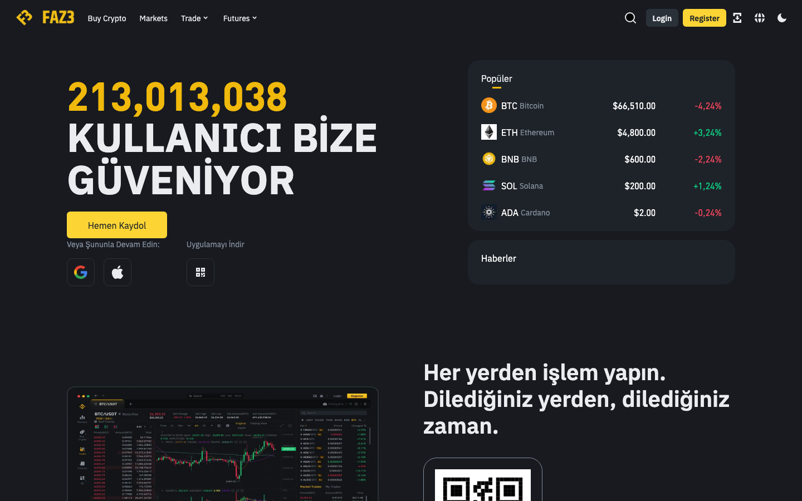
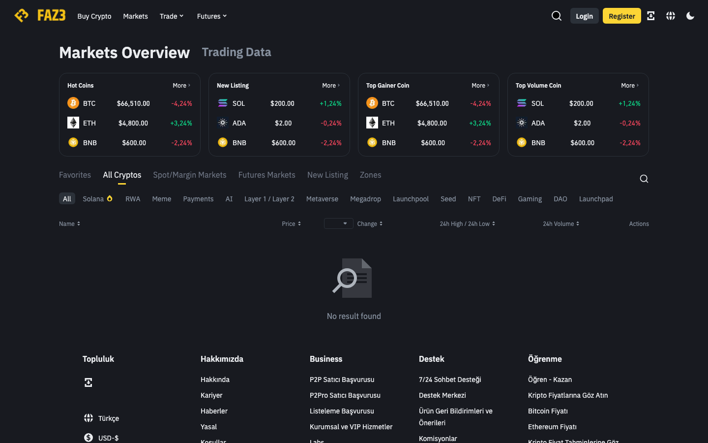
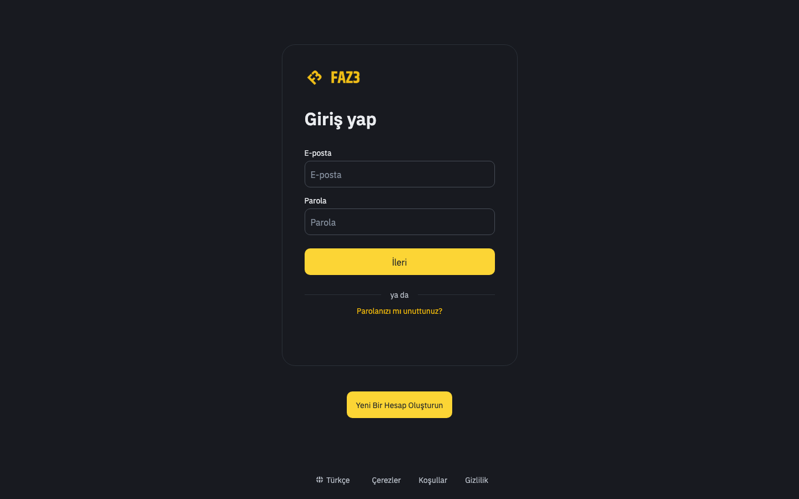
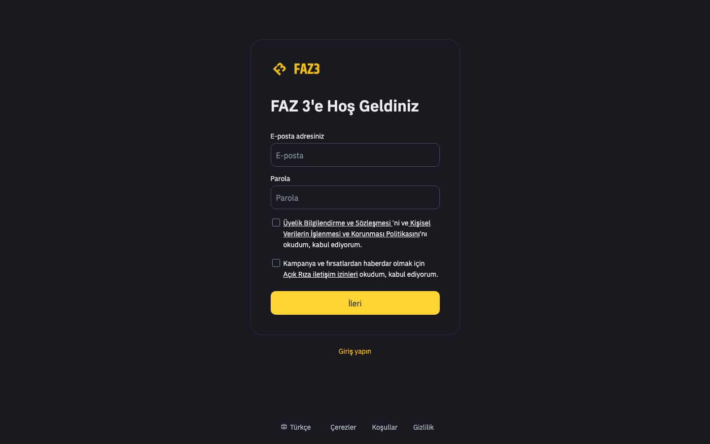

# Fullstack Next.js Crypto Exchange

A full-featured cryptocurrency exchange frontend built with Next.js 14, TypeScript, and real-time WebSocket trading.

## Screenshots

| Home | Markets |
|------|---------|
|  |  |

| Login | Register |
|-------|----------|
|  |  |

## Features

- **Spot Trading** — Market, Limit, Stop-Limit, OCO, Trailing-Stop orders
- **Futures Trading** — Perpetual, quarterly contracts and options
- **Real-time Order Book** — Live data via SignalR WebSocket
- **TradingView Charts** — Integrated charting widgets
- **Multi-factor Authentication** — Google Authenticator, SMS, YubiKey
- **KYC Verification** — Multi-step identity verification
- **Wallet Management** — Deposit, withdraw, transfer with whitelist support
- **Sub-accounts** — Create and manage sub-user accounts
- **Multi-language** — English and Turkish (i18n)
- **Dark / Light Theme**

## Tech Stack

- [Next.js 14](https://nextjs.org/) — App Router
- [TypeScript](https://www.typescriptlang.org/)
- [Redux Toolkit](https://redux-toolkit.js.org/) + Redux Persist
- [Tailwind CSS](https://tailwindcss.com/)
- [SignalR](https://learn.microsoft.com/aspnet/core/signalr/introduction) — Real-time WebSocket
- [Axios](https://axios-http.com/) — HTTP client
- [RxJS](https://rxjs.dev/) — Reactive 2FA flow
- [i18next](https://www.i18next.com/) — Internationalization

## Getting Started

### 1. Clone the repository

```bash
git clone https://github.com/odabasianil/fullstack-nextjs-crypto-exchange.git
cd fullstack-nextjs-crypto-exchange
```

### 2. Install dependencies

```bash
npm install
```

### 3. Configure environment variables

```bash
cp .env.example .env.local
```

Fill in your API URLs in `.env.local`:

```env
NEXT_PUBLIC_API_BASE_URL=https://your-api.example.com/
NEXT_PUBLIC_ORDERBOOK_API_URL=https://your-orderbook-api.example.com/
NEXT_PUBLIC_ORDERBOOK_SOCKET_URL=https://your-orderbook-socket.example.com
NEXT_PUBLIC_APP_DOMAIN=your-domain.example.com
```

### 4. Run the development server

```bash
npm run dev
```

Open [http://localhost:3000](http://localhost:3000) in your browser.

## Project Structure

```
src/
├── app/          # Next.js App Router pages
├── core/         # Services, Redux store, TypeScript models
├── views/        # Feature-level page components
├── components/   # Reusable UI components
├── hooks/        # Custom React hooks
├── utils/        # Helper functions
└── data/         # Static JSON data
```

## Contributors

<table>
  <tr>
    <td align="center">
      <a href="https://github.com/odabasianil">
        <br/>
        <sub><b>odabasianil</b></sub>
      </a>
    </td>
    <td align="center">
      <a href="https://github.com/muhammedaliacis">
        <br/>
        <sub><b>muhammedaliacis</b></sub>
      </a>
    </td>
  </tr>
</table>

## License

MIT
